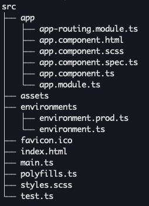

# Angular app structure

* The page you see is the Application Shell. It is controlled by Angular component named AppComponent.
* As mentioned before, components are building blocks of the Angular applications. They display data on screen, listen for your input and do basically everything a user can see.
* The AppComponent that you already have in your app consists of 3 elements:
  * app.module.ts - main entry point for app.
  * app.component.ts – component logic, written in TypeScript.
  * app.component.html – component template in HTML.
  * app.component.scss – SCSS styles of your component.

