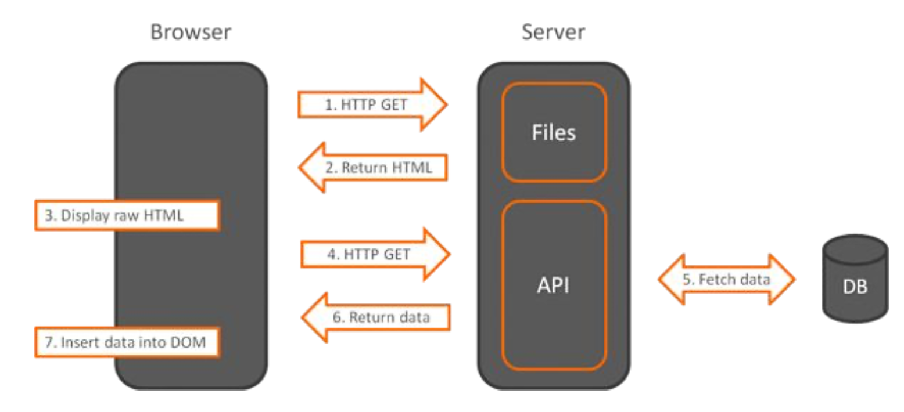

# How do client-side framework work?

Client-side frameworks operate on the browser level and display the data retrieved from the server. Usually, server side just needs to provide a REST API in order for the application to work. So the server doesn’t return the HTML all the time – it mostly returns data in JSON format that the client-side frameworks will operate on.

