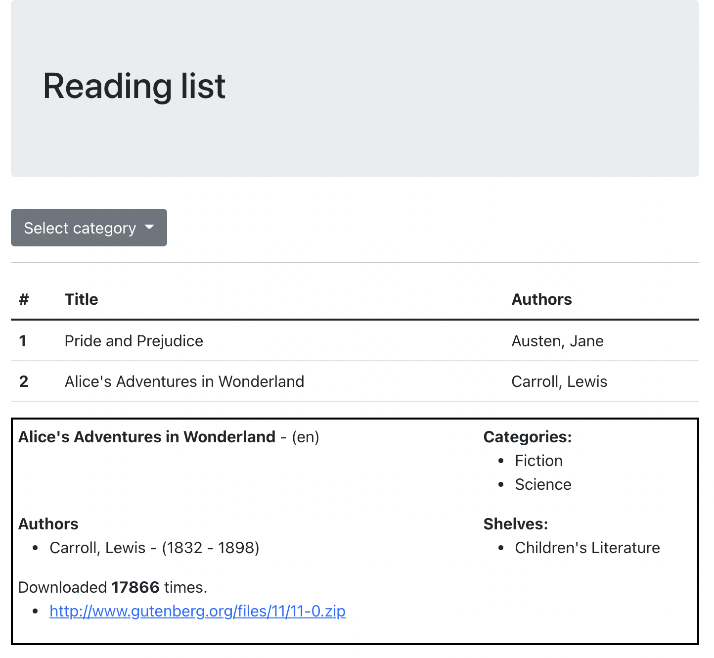
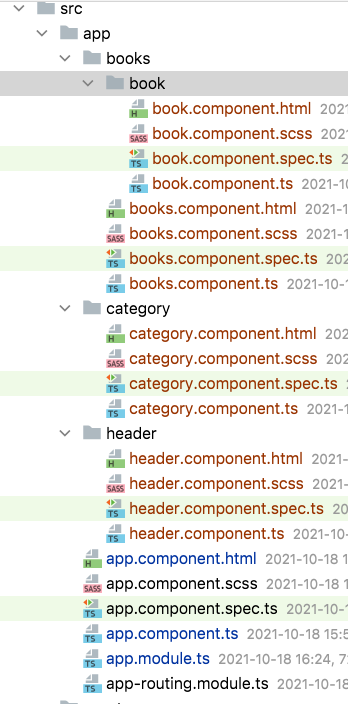

# Exercise 2

By using bootstrap and angular implement application template like in picture below:

Use:
* `ng new bookshelf` - for creating a new application.
* `ng g c [component_name]` - for creating a components.
* `ng serve --open` - for running application and opening it in browser.

You need to create the same component as provided below:

* header.component.html - must contain a page header (title and grey background)
* category.component.html - must contain a dropdown (Science, Fiction).
* books.component.html - table with books list
* book.component.html - book detail

All data is hardcoded right now. You can write the same infromation that you see in pricture above.

