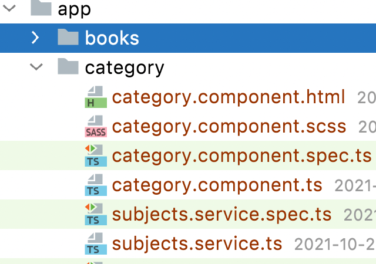
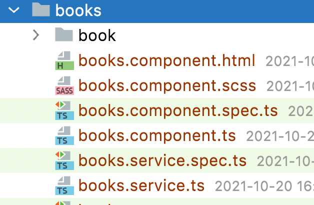

# Exercise 4

* Generate subjects service in category folder:



* In subject service implement method that will return array of subjects: 
```ts
getSubjects(): Subjects {
   return ...;
}
``` 
* Array (`subjects` as `string[]`) of subjects must be hardcoded. We will not do any reuqest to api right now. For `string[]` create a type `type Subjects` (you can use `ng g class category/subjects --type=type` for generating type class) and use it to define a type for hardoced subjects array.
* Make sure that you have injected subjects service in category component.
* In ngOnInit method call subjects service method `getSubjects` and result assign to public component field so it would be possible to use in template. By using component public field subjects apply changes for template:

```html
<li *ngFor="???">
    <a class="dropdown-item" href="#">{{subject}}</a>
</li>
```
* How you can add click event handler to `<a class="dropdown-item" href="#">{{subject}}</a>` so it would be possible to get selected subject in component class and display it in console.log?

---

* Generate books service in books directory:



* In book service implement method that will return array of books: 
```ts
getBooks(): Books {
   return ...;
}
``` 
* Create a model class for book object (ng g class books/book/book --type=model)
* Book class must have properties that will describe book: 
    id,
    authors (array of Author model that have name as string property)
    bookshelves (array of string),
    download_count (number),
    formats (key (string) value (string) object),
    languages (array of string),
    media_type (string),
    subjects (array of string, you can reuse Subjects type as well),
    title (string)
* Array (`books` as `Book[]`) of books must be hardcoded. We will not do any request to api right now. For `Book[]` create a type `type Books` (you can use `ng g class books/books --type=type` for generating type class) and use it to define a type for hardoced subjects array.
* In ngOnInit method call books service method `getBooks` and result assign to public component field (e.g. books) so it would be possible to use it in template. By using component public field books apply changes for template:

```html
<tr *ngFor="???" class="books books__item">
    <th scope="row">???</th>
    <td>???</td>
    <td>???</td>
</tr>
```

* How you can add click event handler to `<tr *ngFor="???" class="books books__item">` so it would be possible to get selected book in component class and display it in console.log?
