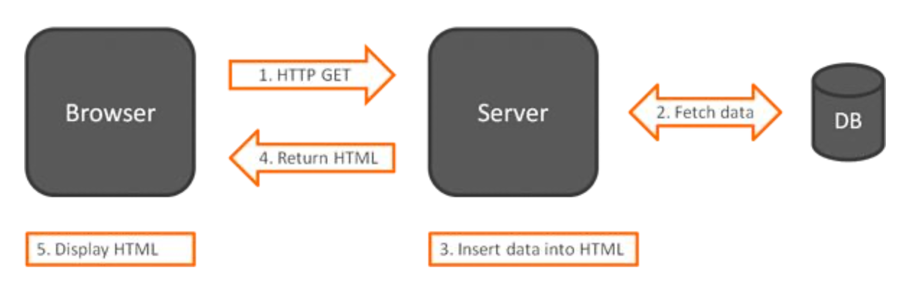

# Traditional web frameworks

* In the 2000s Javascript was just a scripting language – used to create interactions on web pages, commonly using jQuery as only library.
* In 2010 first framework was created – Backbone.js.
* Following the development, language started to adapt – in 2015, ES6 JS
version was released.
* Later, full-scale MVC frameworks (such as AngularJS) appeared.

---

Traditional web frameworks use a straightforward approach to display the data. When the browser requests the data, the server returns raw HTML, and it is displayed in the browser.

