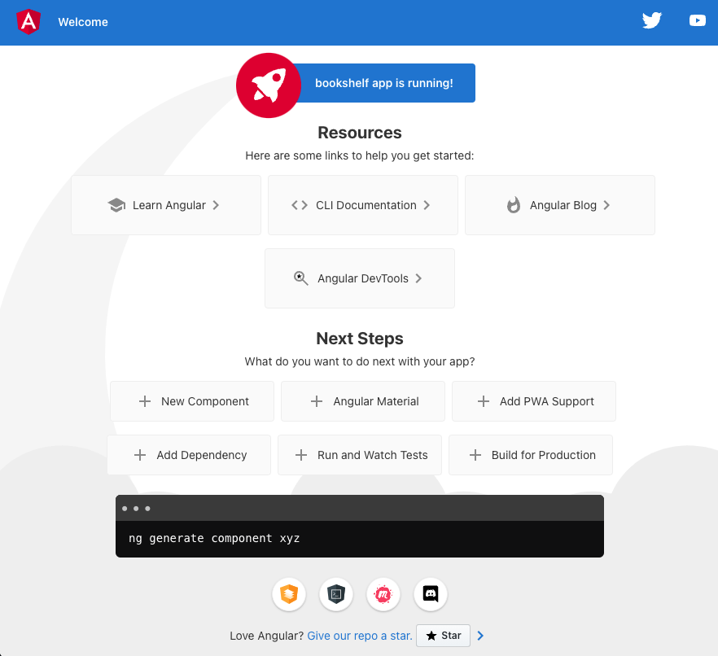

# Setup using provided CLI tools

To install Angular, you will need to have NPM installed on your machine. Node.JS of version 10.9+ is required as well. Once both are installed, perform these steps:

* Run ```npm install -g @angular/cli``` in Command Prompt or Terminal.
* Go into your projects folder and run ```ng new bookshelf```.
* Run command ```cd bookshelf``` to go to the folder of your new application.
* Run command ```ng serve --open```.
* If everything went as planned, your browser should open a new window!


